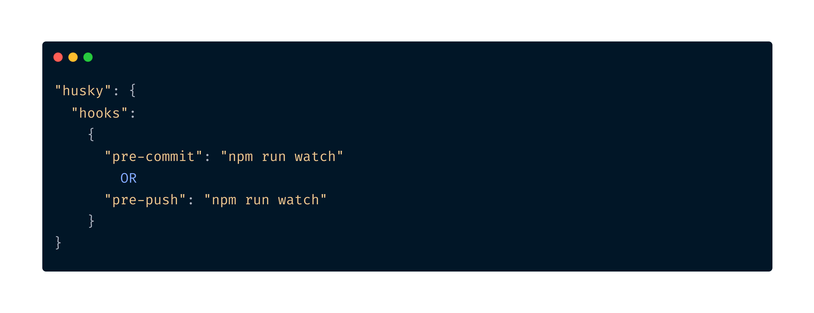

# selectors-watcher

`selector-watcher` act as a git hook and notify relevant stakeholders with any selectors change
in order to avoid instability and lack of communication between developers and automation engineers


## Features

- Detect code changes according to predefined selectors
- Notify stakeholders using **Slack**, showing the old and the new versions of changed selectors
- Add relevant stakeholders as a reviewers in case pull request exists


## Installation & Usage

Install selectors-watcher with npm in you development project

```bash
  npm install selectors-watcher
```

In `package.json` file, you should define a script that executes selectors-watcher.

For example:

```json
"scripts": {
    "watch": node selectors-watcher --config=PATH_TO_CONFIG_FILE 
}
```

You can execute it manually (By running `npm run watch`) or you can defined it as a git pre-commit/pre-push hook.

For example:


## Configuration file

`selectors-watcher` has a configuration file with defualt values.  
Still there are attributtes that **MUST** be chaged in order to perform full functionality.  
In order to override the values, you need to create a configuration file in your

- `channel_id` - The Slack channel ID whrer you want to send the notification
- `token` - Slack token to use for sending messages.  
  Here is a begginer explantion of [How to quickly get and use a Slack API token.](https://api.slack.com/tutorials/tracks/getting-a-token)
- reviewers - Array of github users/groups you would like to add as reviewers for the pull request including the selectors changes.
- owner - github owner.
- repo - github repo name
- token - The access token for using github REST API request.  
  [This is how you can create such token](https://docs.github.com/en/rest/overview/authenticating-to-the-rest-api?apiVersion=2022-11-28#authenticating-with-a-personal-access-token)


```json
{
    "selectorsType": ["id"],
    "slack": {
      "channel_id": "",
      "token": ""
    },
    "github": {
      "reviewers": [],
      "owner": "",
      "repo": "",
      "octokit_token": ""
    },
    "notification_level": "commit"
}
```

## Common used arguments
This arguments should provided in case of overrding the configuration file

- `-c, --config` - The relative path to the configuration file.



